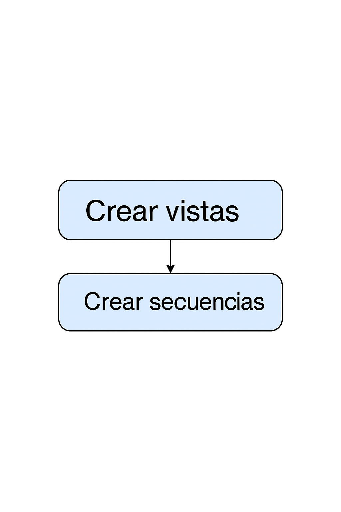
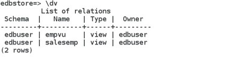

# Fundamentos SQL

## Objetivo de la práctica:
Al finalizar la práctica, serás capaz de:

- Crear Vistas
- Crear Secuencias


## Objetivo Visual 


## Duración aproximada:
- 35 minutos.

## Tabla de ayuda:

| Usuario | Password | 
| --- | --- | 
| root | root| 
## Instrucciones 

### Tarea 1. 

El personal del departamento de RRHH desea ocultar parte de la información de la tabla EMP. Se necesita crear una vista llamada EMPVU basada en los números de empleado, nombres de empleado y números de departamento de la tabla EMP. El encabezado para el nombre del empleado debe ser EMPLOYEE.. Confirma que la vista funciona mostrando su contenido EMPVU. Usando la vista EMPVU, escribe una consulta para el departamento SALES que muestre todos los nombres de empleados y los números de departamento. 


1.	Abrir un terminal y iniciar session como  enterprisedb.  
```bash
su - enterprisedb 
```
Y entonces ingrese el password

2.	Vamos a psql en la base de datos edbstore.
```bash
psql -d edbstore -U edbuser 
```

y escriba la contraseña de edbuser.
 
3.	Ejecuta las siguientes sentencias:
```sql
CREATE VIEW empvu as SELECT empno, ename AS employee, deptno FROM emp;

\dv
```
## Objetivo Visual 


```sql
SELECT * FROM empvu;  
```
```sql
SELECT employee,deptno FROM empvu; 
```


### Tarea 2. 

Necesitas una secuencia para la columna de clave primaria de la tabla dept. La secuencia debe comenzar en 60, tener un valor máximo de 200, e incrementar en 10. Nombra la secuencia como  dept_id_seq. Para probar la secuencia, escribe un script que inserte dos filas en la tabla dept 

1.	Abrir un terminal y iniciar session como  enterprisedb.  
```bash
su - enterprisedb 
```
Y entonces ingrese el password

2.	Ir a  psql en la base de datos edbstore.
```bash
psql -d edbstore -U edbuser 
```
Escriba la contraseña.


3.	Crea la secuencia para el campo dept id:
```sql
CREATE SEQUENCE dept_id_seq START WITH 60 Increment BY 10 
MAXVALUE 200; 
```

4.	Inserta dos filas usando la secuencia:
```sql
INSERT INTO dept VALUES (nextval('dept_id_seq'), 
'SERVICES'), (nextval('dept_id_seq'), 'TRAINING'); 
```


5.	Salir de psql. 
```sql
\q 
```
