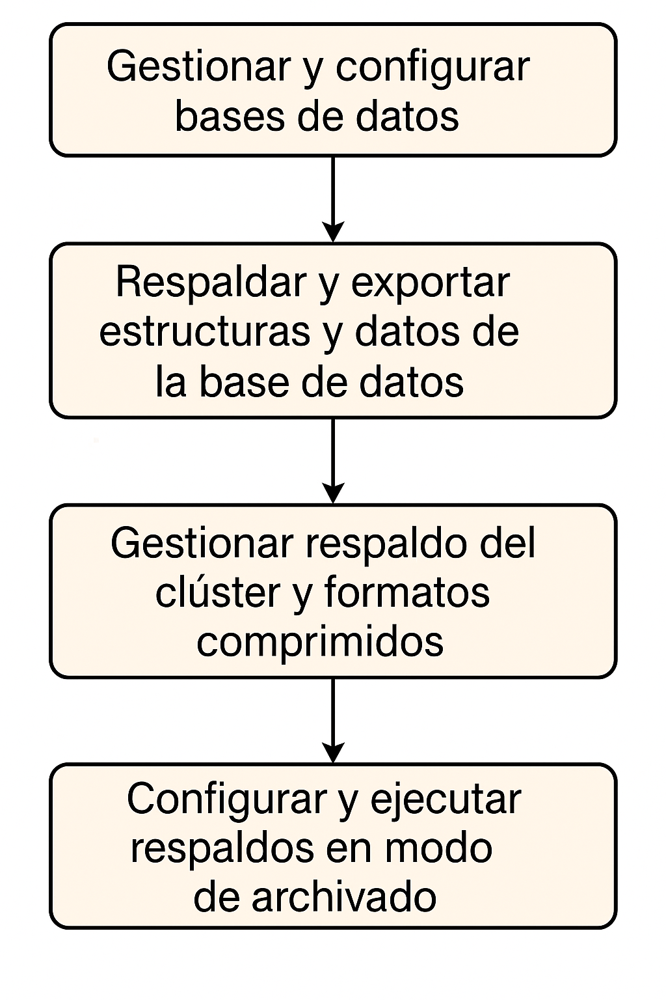
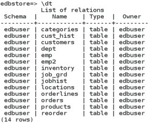
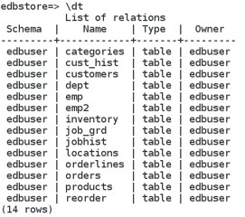

# Respaldo, Recuperación y PITR (Backup, Recovery & PITR)

## Objetivo de la práctica:
Al finalizar la práctica, serás capaz de:

- Gestionar y configurar bases de datos mediante conexión, exploración, diagnóstico, asignación de privilegios y creación de objetos como vistas y secuencias.
- Respaldar y exportar estructuras y datos de la base de datos mediante dumps específicos de esquemas, tablas y datos, optimizando el proceso de restauración.
- Gestionar respaldo del clúster y formatos comprimidos
- Restaurar una base de datos
- Configurar y ejecutar respaldos en modo de archivado, asignando permisos y ubicaciones de almacenamiento para garantizar la recuperación y continuidad del clúster de base de datos.


## Objetivo Visual 


## Duración aproximada:
- 60 minutos.

## Tabla de ayuda:

| Usuario | Password | 
| --- | --- | 
| root | root| 
## Instrucciones 

### Tarea 1. 

La base de datos edbstore está completamente configurada, y como DBA debes planificar e implementar una estrategia de respaldo
- Como usuario root, crea una carpeta /pgbackup y asigna la propiedad al usuario enterprisedb (usando el comando chown o las propiedades del sistema en Windows).
- Realiza un respaldo completo (dump) de la base de datos edbstore utilizando la utilidad pg_dump.
- El respaldo debe estar en formato de texto plano y debe guardarse como edbstore_full.sql en el directorio /pgbackup


1.	Inicia sesión como usuario root.
```bash
su - root 
```

2. Cree la carpeta /pgbackup y asignele la propiedad al usuario enterprisedb mediante la utilidad chown la pestaña de seguridad de Windows en las propiedades de la carpeta. Escriba los siguientes comandos:

```bash
mkdir /pgbackup
```
```bash
chown enterprisedb:enterprisedb /pgbackup  
```
```bash
su – enterprisedb 
```

2.	Realice un volcado completo de la base de datos edbstore con la utilidad pg_dump. El volcado debe estar en texto sin formato. Asigne al archivo de volcado el nombre edbstore_full.sql y guarda en el directorio /pgbackup. Escriba:
```bash
pg_dump -f /pgbackup/edbstore_full.sql -U enterprisedb edbstore 
```
A continuación, introduzca la contraseña de enterprisedb. 

### Tarea 2. 

En este laboratorio practicarás diferentes tipos de respaldos:

- Realiza un dump del esquema edbuser de la base de datos edbstore y nómbralo edbuser_schema.sql.
- Realiza un dump solo de datos de la base de datos edbstore, deshabilita los triggers para una restauración más rápida, usa el comando INSERT en lugar de COPY, y nómbralo edbstore_data.sql.
- Realiza un dump completo de la tabla customers y nómbralo edbstore_customers.sql

1.	Inicia sesión como en enterprisedb.
```bash
su - enterprisedb 
```

2.	Realice un volcado del esquema de edbuser desde la base de datos edbstore y asigne al archivo de volcado el nombre edbuser_schema.sql.  Escriba:
```bash
pg_dump -n edbuser -f /pgbackup/edbuser_schema.sql -U enterprisedb edbstore 
```
Luego escriba la contraseña de enterprisedb.

3.	Realice un volcado de solo datos de la base de datos edbstore, deshabilite todos los activadores para una restauración más rápida y use el comando de inserción en lugar de copiar, luego nombre el archivo como dbstore_data.sql.  Escriba 
```bash
pg_dump --inserts --disable-triggers –a -f /pgbackup/edbstore_data.sql -U enterprisedb edbstore 
```
Luego escriba la contraseña de EnterpriseDB.

4.	Tome un volcado completo de la tabla de clientes y nombre del archivo edbstore_customers.sql.  Escribe:
```bash
pg_dump -t edbuser.customers -f /pgbackup/edbstore_customers.sql -U enterprisedb edbstore 
```
Luego escriba la contraseña de EnterpriseDB.


### Tarea 3. 
En este laboratorio practicarás respaldo del clúster y formatos comprimidos:
- Realiza un dump completo de la base de datos edbstore en formato comprimido, nómbralo edbstore_full_fc.dmp 
- Realiza un dump completo del clúster de base de datos usando pg_dumpall. Recuerda pg_dumpall en formato de texto plano, y nómbralo edbdata.sql 


1.	Abrir un terminal y iniciar session como  enterprisedb.  
```bash
su - enterprisedb 
```
Y entonces ingrese el password

2.	Realice un volcado completo de la base de datos de edbstore en formato comprimido utilizando la utilidad pg_dump y asigne el archivo el nombre edbstore_full_fc.dmp.  Escribe: 
```bash
pg_dump -Fc -f /pgbackup/edbstore_full_fc.dmp -U enterprisedb -d edbstore  
```
Luego escriba la contraseña de enterprisedb

3.	Realice un volcado completo del clúster de la base de datos con pg_dumpall. Recuerde que pg_dumpall solo admite texto sin formato; asígnele al archivo el nombre edbdata.sql.  Escribe:
```bash
pg_dumpall -p 5444 -U enterprisedb -f /pgbackup/edbdata.sql 
```
y luego escriba la contraseña de enterprisedb 5 o 6 veces, según sea necesario.

### Tarea 4. 

Demuestra tu capacidad para restaurar una base de datos:

- Elimina la base de datos edbstore.
- Crea nuevamente la base de datos edbstore con propietario edbuser.
- Restaura el respaldo edbstore_full.sql y verifica los objetos y sus propietarios.
- Elimina la base de datos nuevamente.
- Crea la base de datos edbstore con propietario edbuser.
- Restaura el respaldo comprimido edbstore_full_fc.dmp y verifica los objetos y sus propietarios.


1.	Abrir un terminal y iniciar session como  enterprisedb.  
```bash
su - enterprisedb 
```
Luego introduce la *contraseña de enterprisedb*. 

2.	Elimina la base de datos edbstore.  Escribe 
```bash
dropdb edbstore 
```
Luego introduce la contraseña de enterprisedb.

3.	Crea nuevamente la base de datos edbstore con el propietario edbuser. Escribe:
```bash
createdb -O edbuser edbstore 
```
Luego introduce la contraseña de enterprisedb.

4.	Lista los archivos de respaldo. Escribe:
```bash
ls /pgbackup 
```

5.	Restaura el respaldo completo desde edbstore_full.sql y verifica todos los objetos y sus propietarios. Escribe:
```bash
psql -f /pgbackup/edbstore_full.sql -d edbstore -U edbuser  
```
Luego introduce la contraseña del usuario edbuser.

6.	Conéctate a la base de datos edbstore como el usuario edbuser.  Escribe:
```bash
psql -d edbstore -U edbuser 
```
Luego introduce la contraseña de edbuser.

7.	Lista las tablas de la base de datos edbstore. Escribe:
```bash
\dt 
```


8.	Salir de psql. Escribe:
```bash
\q 
```

9.	Elimina la base de datos edbstore.  Escribe:
```bash
dropdb edbstore 
```
Luego introduce la contraseña del usuario enterprisedb..

10.	Crea nuevamente la base de datos edbstore con el propietario edbuser. Escribe:
```bash
createdb -O edbuser edbstore 
```
Luego introduce la contraseña del usuario enterprisedb.

11.	Restaura el respaldo completo desde el archivo comprimido edbstore_full_fc.dmp y verifica todos los objetos y sus propietarios.  Escribe:
```bash
pg_restore -d edbstore –Fc /pgbackup/edbstore_full_fc.dmp  
```	

12.	Inicia sesión en psql para la base de datos edbstore. Escribe:
```bash
psql -d edbstore -U edbuser 
```

13.	Muestra la lista de tablas de la base de datos edbstore. Escribe 
```bash
\dt
```


14.	Sal del entorno psql. Escribe:
```bash
\q 
```


### Tarea 5. 

En esta tarea podrás: 
- Crea un directorio/opt/arch o c:\arch y asigna la propiedad al usuario enterprisedb.
- Configura tu clúster para ejecutarse en modo de archivado (archive mode) y establece la ubicación de los logs de archivo en /opt/arch o c:\arch.
- Realiza un respaldo completo en línea de tu clúster dentro del directorio /pgbackup utilizando la utilidad pg_basebackup. 


1.	Abre una terminal e inicia sesión como usuario root. Escribe:
```bash
su - root 
```
Luego introduce la contraseña de root..


2.	Crea un directorio /opt/arch o c:\arch y asígnale la propiedad al usuario enterprisedb. Escribe:
```bash
mkdir /opt/arch 
```

3.	Otorga la propiedad del directorio al usuario enterprisedb . Escribe:
```bash
chown –R enterprisedb:enterprisedb /opt/arch/ 
```

4.	Conéctate como el usuario enterprisedb.  Escribe:
```bash
su - enterprisedb  
```

5.	Abre el archivo de configuración. Escribe:
```bash
vi /var/lib/edb/as13/data/postgresql.conf   
```

6.	Modifica los siguientes parametros: 
```bash
wal_level = replica  ( this is default) archive_mode = on 
archive_command = 'cp %p /opt/arch/%f' 
max_wal_senders = 2 (default is 10) 
```

7.	Guarda y cierra el editor vi. Escribe: 
```bash
<ESC>:wq <enter> 
```

8.	Abre el archivo de configuración pg_hba.conf. Escribe:
```bash
vi	/var/lib/edb/as13/data/pg_hba.conf 
```

9.	Si están comentadas, descomenta las siguientes entradas: 
- local replication all  md5 
- host replication all 127.0.0.1/32 md5 
- host replication all ::1/128 md5 

10.	Guarda y cierra el archivo. Escribe:
```bash
<ESC>:wq <enter> 
```

11.	Reinicia el servidor. Escribe:
```bash
pg_ctl -D /var/lib/edb/as13/data restart  
```

12.	Realiza la copia de seguridad. Escribe:
```bash
pg_basebackup -h localhost -D /pgbackup/data 
```
Luego introduce la contraseña del usuario enterprisedb.

