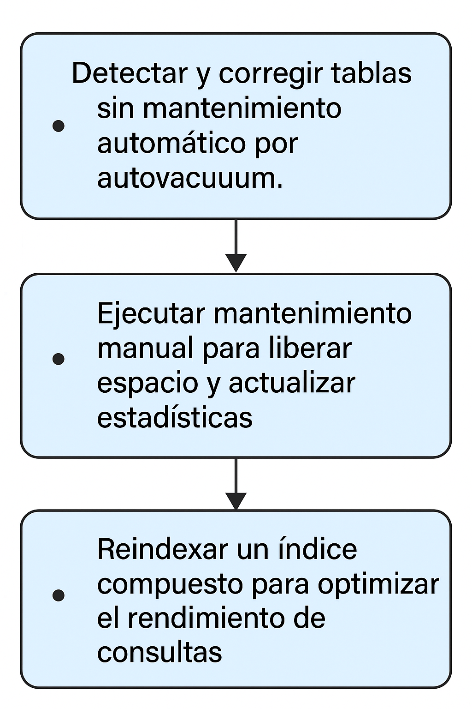
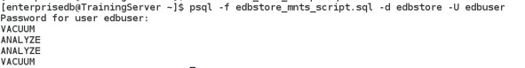

# Rutinas de Tareas de Mantenimiento

## Objetivo de la práctica:
Al finalizar la práctica, serás capaz de:

- Detectar y corregir tablas sin mantenimiento automático por autovacuum.
- Ejecutar mantenimiento manual para liberar espacio y actualizar estadísticas.
- Reindexar un índice compuesto para optimizar el rendimiento de consultas.

## Objetivo Visual 


## Duración aproximada:
- 40 minutos.

## Tabla de ayuda:

| Usuario | Password | 
| --- | --- | 
| root | root| 
## Instrucciones 

### Tarea 1. 

Mientras monitoreabas las estadísticas de las tablas en la base de datos edbstore, descubriste que algunas no son mantenidas automáticamente por autovacuum. Decides realizar mantenimiento manual sobre estas tablas escribiendo un script SQL que ejecute las siguientes tareas:

-	Reclamación del espacio de filas obsoletas en la tabla customers . 
-	Actualización de estadísticas para las tablas emp y dept. 
-	Marcado de todas las filas obsoletas en la tabla orders para su reutilización. 

1.	Abre una terminal e inicia sesión como el usuario enterprisedb. Escribe:
```bash
su - enterprisedb 
```
Luego introduce la contraseña de enterprisedb.


2.	Crea un script SQL para realizar mantenimiento en las tablas customers, emp, dept y orders.  Para crear el script escribe:
```bash
vi edbstore_mnts_script.sql 
```
Luego presiona  "INSERT" e ingresa las siguientes instrucciones:
```bash
VACUUM FULL customers; 
ANALYZE emp; 
ANALYZE dept; 
VACUUM orders; 
```

3.	Guarda y cierra el archivo. Escribe:

```bash
<ESC>:wq <Enter> 
```

4.	Ejecuta el script.  Escribe:
```bash
psql -f edbstore_mnts_script.sql -d edbstore -U edbuser 
```
Luego introduce la contraseña del usuario edbuser. 



### Tarea 2. 
El índice compuesto llamado ix_orderlines_orderid, basado en las columnas (orderid, orderlineid) de la tabla orderlines, está mostrando un rendimiento muy lento. Escribe una instrucción para reindexar este índice y mejorar su desempeño.

1.	Abre una terminal e inicia sesión como el usuario enterprisedb. Escribe:
```bash
su - enterprisedb 
```
Luego introduce la contraseña de enterprisedb.

2.	Vamos a psql Conéctate a la base de datos edbstore . Escribe: 
```bash
psql -d edbstore -U edbuser 
```
Luego introduce la contraseña del usuario edbuser.

3.	Escribe la instrucción para reconstruir el índice. Escribe:
```sql
REINDEX INDEX ix_orderlines_orderid; 
```

4.	Sal de psql. Escribe:
```sql
 \q
```
