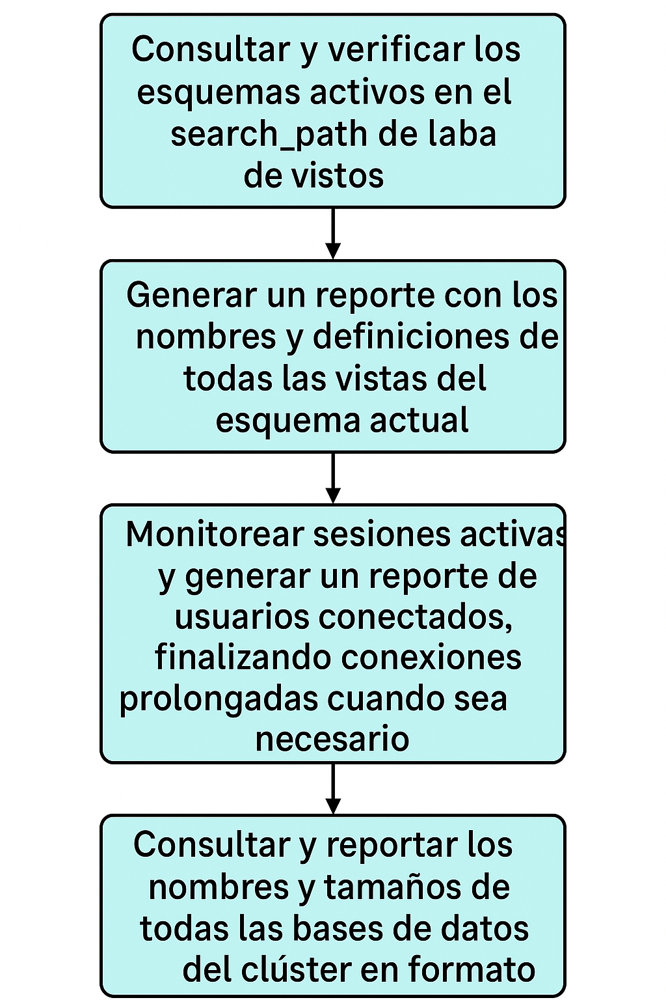
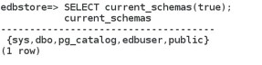
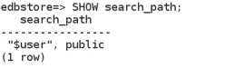
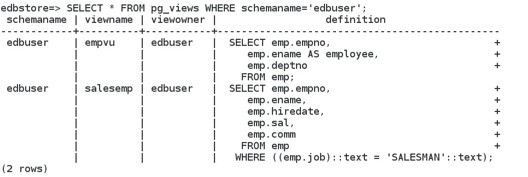
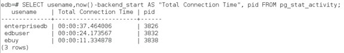
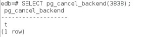
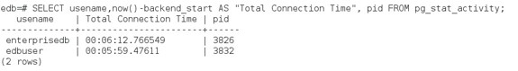
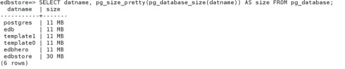

# Diccionario de datos

## Objetivo de la práctica:
Al finalizar la práctica, serás capaz de:

- Consultar y verificar los esquemas activos en el search_path de la base de datos.
- Generar un reporte con los nombres y definiciones de todas las vistas del esquema actual.
- Monitorear sesiones activas y generar un reporte de usuarios conectados, finalizando conexiones prolongadas cuando sea necesario.
- Consultar y reportar los nombres y tamaños de todas las bases de datos del clúster en formato legible.

  
## Objetivo Visual 


## Duración aproximada:
- 40 minutos.

## Tabla de ayuda:

| Usuario | Password | 
| --- | --- | 
| root | root| 
## Instrucciones 

### Tarea 1. 

Estás trabajando con distintos esquemas en una base de datos. Después de un tiempo, necesitas determinar qué esquemas están actualmente en tu ruta de búsqueda (search_path). Escribe una consulta para mostrar la lista de esquemas que se encuentran en tu search path actual. 


1.	Abre una terminal e inicia sesión como el usuario enterprisedb. Escribe:
```bash
su - enterprisedb 
```
Luego la contraseña.

2.	Conectate a psql a la base de datos edbstore.  Escribe:
```bash
psql -d edbstore -U edbuser 
```
y escriba la contraseña de edbuser.

3.	Revisa la ruta de búsqueda actual. Escribe:
```sql
SELECT current_schemas(true); 
```



4.	Muestra la lista de esquemas en tu ruta de búsqueda. Escribe:
```sql
SHOW search_path; 
```


5.	Salir de psql. Escribe \q 
```sql
\q 
```

### Tarea 2. 
Necesitas determinar los nombres y definiciones de todas las vistas en tu esquema. Crea un reporte que recupere esta información: el nombre de la vista y el texto de su definición. 


1.	Abre una terminal e inicia sesión como el usuario enterprisedb. Escribe:
```bash
su - enterprisedb 
```
Luego la contraseña.

2.	Conectate a psql a la base de datos edbstore.  Escribe:
```bash
psql -d edbstore -U edbuser
```
y escriba la contraseña de edbuser.

3.	Crea un reporte que muestre la información de las vistas (nombre y definición). Escribe:
```sql
SELECT * FROM pg_views WHERE schemaname='edbuser'; 
```


4. Sal de psql 
```sql
\q
```

### Tarea 3. 

crea un reporte con todos los usuarios que actualmente están conectados. El reporte debe mostrar el tiempo total de sesión de todos los usuarios conectados.  Descubriste que un usuario ha estado conectado al servidor por mucho tiempo y decidiste finalizar su conexión de manera controlada. Escribe la instrucción para realizar esta tarea. 

1.	Abre tres ventanas de terminal e inicia sesión como el usuario enterprisedb en cada una.  Escribe:
```bash
su – enterprisedb 
```
Luego introduce la contraseña en cada ventana. 

2.	Conéctese a psql a la base de datos edb como el usuario enterprisedb, el usuario edbuser y el usuario ebuy.

- Ventana 1 Escribe el siguiente código y luego ingresa la contraseña
```bash
psql -d edb -U enterprisedb 
```

- Ventana 2 Escribe el siguiente código y luego ingresa la contraseña
```bash
psql -d edb -U edbuser 
```

- Ventana 3 Escribe el siguiente código y luego ingresa la contraseña
```bash
psql -d edb -U ebuy 
```

3. Desde la terminal de enterprisedb, crea un reporte de todos los usuarios que están actualmente conectados. El reporte debe mostrar el tiempo total de sesión de todos los usuarios conectados. Escribe
```sql
SELECT usename,now()-backend_start AS "Total Connection Time", pid FROM pg_stat_activity; 
```


4.	Detectas que el usuario ebuy ha estado conectado por demasiado tiempo. Finaliza su conexión de forma segura:ebuy finaliza su conexion de forma segura. Escribe una declaración para realizar esta tarea. Escribe:

```sql
SELECT pg_cancel_backend(3838);
```
((Nota: reemplaza 3838 con el número de PID que aparezca en tu reporte).). 



5.	Ejecuta nuevamente el reporte de conexiones.Escribe:
```sql
SELECT usename,now()-backend_start AS "Total Connection Time", pid FROM pg_stat_activity; 
```


6.	Sal de psql con: 
```sql
\q 
```

### Tarea 4. 
Escribe una consulta para mostrar el nombre y tamaño de todas las bases de datos en tu clúster. El tamaño debe mostrarse usando una unidad legible.. 

1.	Abre una terminal e inicia sesión como el usuario enterprisedb. Escribe:
```bash
su - enterprisedb 
```
Luego la contraseña.

2.	Conectate a psql a la base de datos edbstore.  Escribe:
```bash
psql -d edbstore -U edbuser
```
y escriba la contraseña de edbuser.

3.	Escriba una consulta para mostrar el nombre y el tamaño de todas las bases de datos de su clúster. El tamaño debe mostrarse en una unidad significativa. Escribe:
```sql
SELECT datname, pg_size_pretty(pg_database_size(datname)) AS size FROM pg_database; 
```


4.	Sal de psql con: 
```sql
\q 
```
