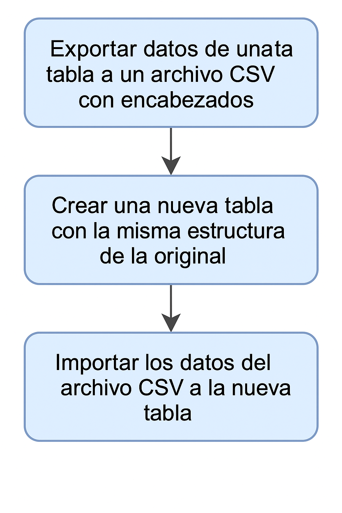
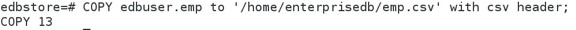
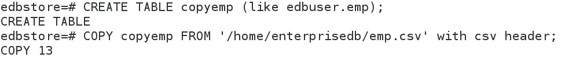

# Moviendo Datos 

## Objetivo de la práctica:
Al finalizar la práctica, serás capaz de:

- ExportaR la tabla emp del esquema edbuser a un archivo CSV, incluyendo los encabezados de las columnas. 
- CreaR una tabla copyemp con la misma estructura que la tabla emp. 
- CargaR el archivo CSV (del paso 1) en la tabla copyemp. 


## Objetivo Visual 


## Duración aproximada:
- 20 minutos.

## Tabla de ayuda:

| Usuario | Password | 
| --- | --- | 
| root | root| 
## Instrucciones 

### Tarea 1. 

1.	Abre una terminal e inicia sesión como el usuario enterprisedb.  Escribe:
```bash
su - enterprisedb 
```
Luego la contraseña.

2.	Conéctate a la base de datos edbstore .  Escribe:
```bash
psql -d edbstore -U enterprisedb  
```
y luego la contraseña de enterprisedb .

3.	Descargue la tabla emp del esquema edbuser del archivo csv, on encabezados de columna. Escribe:
```sql
COPY edbuser.emp to '/home/enterprisedb/emp.csv' with csv header; 
```


4.	Crea la table copyemp con la misma estructura emp .  escribe:
```sql
CREATE TABLE copyemp (like edbuser.emp); 
```

5.	Importa el archive del paso 1 a la tabla copyemp.  Escribe: 
```sql
COPY copyemp FROM '/home/enterprisedb/emp.csv' with csv header; 
```


6.	Salir  psql escribe: 
```sql
\q 
```
