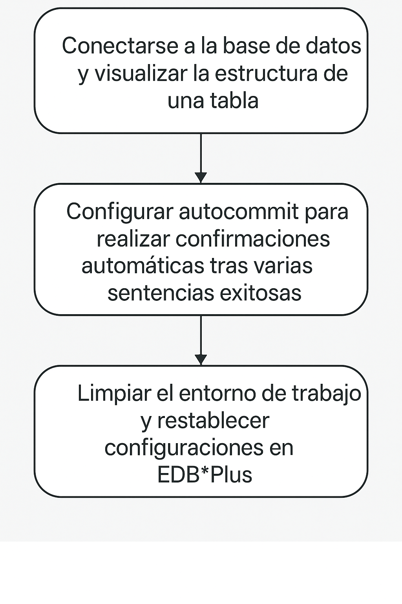

# EDB*Plus 

## Objetivo de la práctica:
Al finalizar la práctica, serás capaz de:

- Conectarse a la base de datos y visualizar la estructura de una tabla.
- Configurar autocommit para realizar confirmaciones automáticas tras varias sentencias exitosas.
- Limpiar el entorno de trabajo y restablecer configuraciones en EDB*Plus.

## Objetivo Visual 


## Duración aproximada:
- 20 minutos.

## Tabla de ayuda:

| Usuario | Password | 
| --- | --- | 
| root | root| 
## Instrucciones 

### Tarea 1. 

1.	EDB*Plus es una interfaz de línea de comandos que acepta sentencias SQL, bloques SPL anónimos y comandos propios de EDB*Plus.
Los comandos de EDBPlus son compatibles con los de **Oracle SQLPlus**. 

2.	Abre EDB*Plus y conéctate a la base de datos edb.  Escribe los siguientes comandos: 

```bash
cd /usr/edb/as13/edbplus 
```

```bash
./edbplus.sh enterprisedb/edb@localhost:5444/edb   
```

3.	Para ver la estructura de la tabla orders.
- Conéctate a la base de datos edbstore como edbuser. Escribe:
```bash
connect edbuser/edbuser@localhost:5444/edbstore  
```
- Muestra la estructura de la tabla: 
```bash
desc orders; 
```

4.	Configura la sesión para hacer commit después de 10 sentencias exitosas: escribe:
```bash
SET AUTOCOMMIT 10; 
```


5.	Activa el autocommit:
```bash
SET AUTOCOMMIT on; 
```

6.	Limpia el búfer, las configuraciones de columnas y la pantalla:  
```bash
CLEAR BUFFER; 
```

7.	Salir EDB*Plus escribe:
```bash
EXIT 
```

8.	 Configura una variable de login por defecto
- Crea el archivo
```bash
sudo vi ~/login.sql  
```

- Presiona "INSERT" y escribe:
```bash
define edbstore="localhost:5444/edbstore" 
```

- Guarda y cierra el archivo:
```bash
<ESC>:wq 
```
	 
