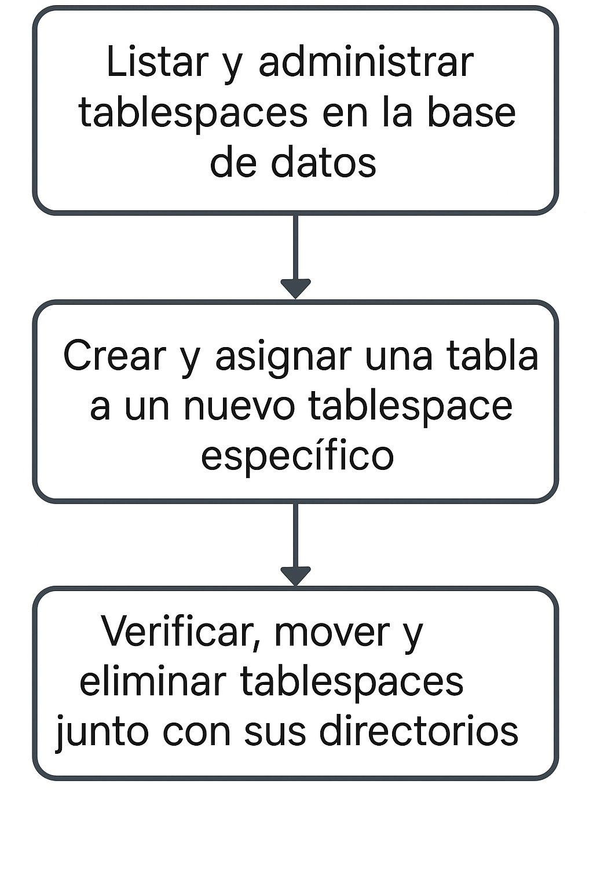

# Tablespaces 

## Objetivo de la práctica:
Al finalizar la práctica, serás capaz de:

- Listar y administrar tablespaces en la base de datos.
- Crear y asignar una tabla a un nuevo tablespace específico.
- Verificar, mover y eliminar tablespaces junto con sus directorios.

## Objetivo Visual 


## Duración aproximada:
- 20 minutos.

## Tabla de ayuda:

| Usuario | Password | 
| --- | --- | 
| root | root| 
## Instrucciones 

### Tarea 1. 


1.	Escribe el commando de edb-psql Ver la lista de tablespaces.

- Conéctate a la base de datos edb como enterprisedb.  Escribe:
```bash
edb-psql -d edb -U enterprisedb 
```

- Lista los tablespaces 
```bash
\db  
```

- Sal de psql. 
```bash
\q   
```

2.	Crear el directorio labtab.
```bash
mkdir labtab 
```

3.	Conéctate a la base de datos edb con el usuario enterprisedb.  Escribe:
```bash
edb-psql -p 5444 edb enterprisedb  
```

4.	Crea el tablespace labtab. Escribe;
```sql
CREATE TABLESPACE labtab LOCATION '/home/enterprisedb/labtab'; 
```

5.	Crea la tabla labtest dentro del tablespace labtab.  Escribe:
```sql
CREATE TABLE labtest (
lab_no number primary key, 
lab_name varchar(32)
) TABLESPACE labtab; 
```

6.	Verifica la ubicación del archivo físico de la tabl. Escribe:
```sql
SELECT pg_relation_filepath('labtest'); 
```

7.	Mueve la tabla labtest al tablespace pg_default .  
```sql
ALTER Table labtest SET TABLESPACE pg_default; 
```

8.	Elimina el tablespace labtab y el directorio asociado.  Escrito:
```sql
DROP TABLESPACE labtab; 
```

9.	Sal de psql. 
```sql
\q  
```

10.	Elimina el directorio labtab.  
```bash
rm -rf labtab 
```
