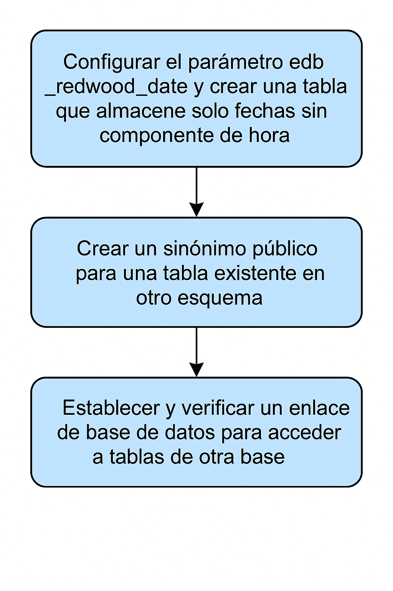

# Compatibilidad con Oracle (Oracle Compatibility) 

## Objetivo de la práctica:
Al finalizar la práctica, serás capaz de:

- Configurar el parámetro edb_redwood_date y crear una tabla que almacene solo fechas sin componente de hora.
- Crear un sinónimo público para una tabla existente en otro esquema.
- Establecer y verificar un enlace de base de datos para acceder a tablas de otra base dentro del mismo clúster.

## Objetivo Visual 


## Duración aproximada:
- 30 minutos.

## Tabla de ayuda:

| Usuario | Password | 
| --- | --- | 
| root | root| 
## Instrucciones 

### Tarea 1. 

- Has instalado EDB Postgres Advanced Server en modo de compatibilidad con Oracle y deseas almacenar fechas sin componente de hora en una columna del tipo de dato DATE.
Configura el parámetro edb_redwood_date y crea una tabla que almacene valores de fecha sin marca de tiempo (timestamp) en las columnas de tipo. 

- Crea un sinónimo llamado department para la tabla dept. la tabla dept existe en el esquema enterprisedb de la base de datos edb y es propiedad del usuario enterprisedb.
El sinónimo debe ser público. 

- Estás conectado a la base de datos edb dentro de tu clúster de EDB Postgres Advanced Server.
Crea un enlace de base de datos (database link) hacia la base de datos edbstore dentro del mismo clúster y verifica que funcione correctamente recuperando todas las filas de la tabla orders.  Recupera una lista de todas las tablas accesibles en la sesión actual.


1.	Configura el parámetro edb_redwood_date  en “off”.  Escribe:
```bash
vi /var/lib/edb/as13 /data/postgresql.conf 
```

2.	Agrega o modifica la siguiente línea:
```bash
edb_redwood_date=off  
```

3.	Guarda y cierra el archivo  
```bash
<ESC>:wq 
```

4.	Conéctate a la base de datos edb como el usuario enterprisedb.
```bash
psql –d edb –U enterprisedb 
```

5.	Crea una tabla que almacene solo fechas (sin hora)
```sql
CREATE TABLE birthday (dob date); 
```

6.	Inserta un registro en la tabla birthday: 
```sql
INSERT INTO birthday VALUES (now()); 
```

7.	Inserta un registro en la tabla birthday::
```sql
SELECT * FROM birthday; 
```

8.	Crea un sinónimo llamado department para la dept.  
```sql
CREATE SYNONYM department FOR enterprisedb.dept; 
```

9.	Crea un enlace de base de datos (database link) hacia la base edbstore. 
```sql
CREATE DATABASE LINK store
CONNECT TO edbuser IDENTIFIED BY 'edbuser' 
using libpq 'host=localhost port=5444 dbname=edbstore'; 
```

10.	Verifica el funcionamiento del enlace recuperando los registros de la tabla orders:
```sql
SELECT * FROM edbuser.orders@store; 
```

11.	Recupera la lista de tablas accesibles en la sesión actual: 
```sql
\dt  
```
