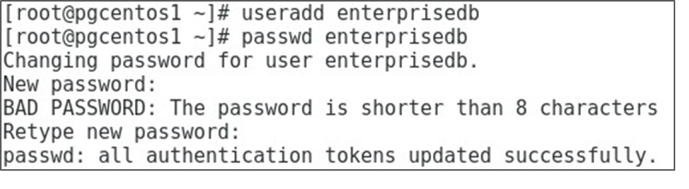
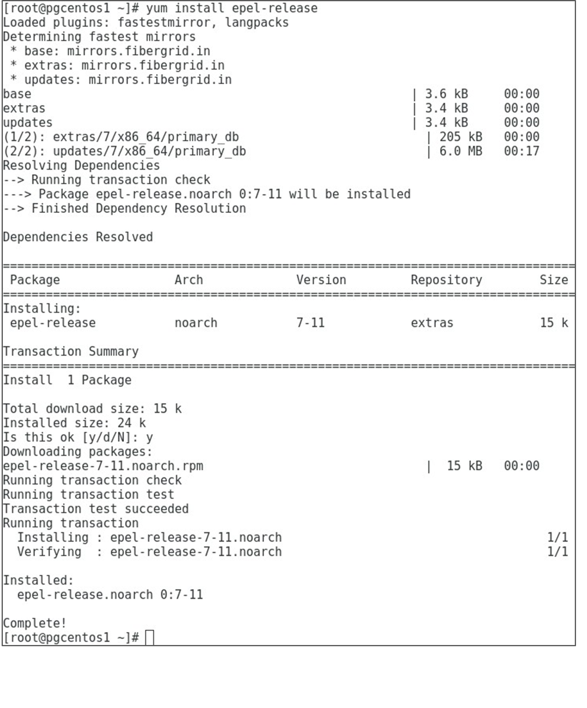
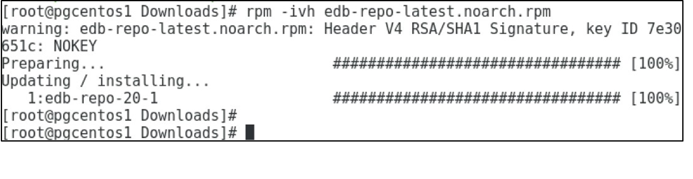
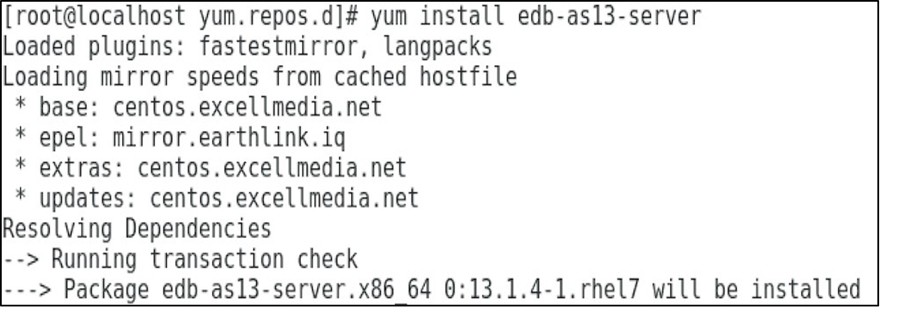
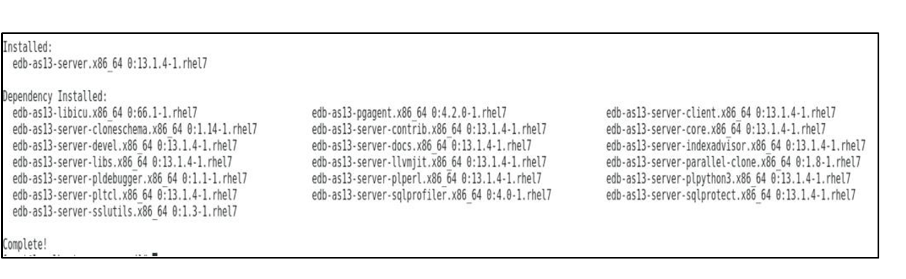
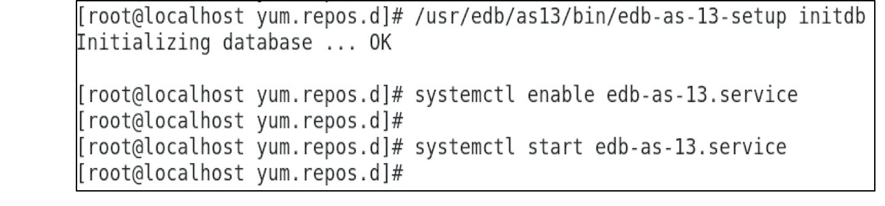

# Instalación de EDB Postgres Advanced Server

## Objetivo de la práctica:
Al finalizar la práctica, serás capaz de:
1.	Elegir la plataforma en la que deseas instalar EDB Postgres Advanced Server.
2.	Descargar el instalador de EDB Postgres Advanced Server desde el sitio web de EnterpriseDB correspondiente a la plataforma elegida.
3.	Preparar la plataforma para la instalación.
4.	Instalar EDB Postgres Advanced Server.
5.	Conéctar a EDB Postgres Advanced Server utilizando psql.


## Objetivo Visual 
Crear un diagrama o imagen que resuma las actividades a realizar, un ejemplo es la siguiente imagen. 


## Duración aproximada:
- 90 minutos.

## Tabla de ayuda:
Agregar una tabla con la información que pueda requerir el participante durante el laboratorio, como versión de software, IPs de servers, usuarios y credenciales de acceso.
| Contraseña | Correo | Código |
| --- | --- | ---|
| Netec2024 | edgardo@netec.com | 123abc |

## Instrucciones 
<!-- Proporciona pasos detallados sobre cómo configurar y administrar sistemas, implementar soluciones de software, realizar pruebas de seguridad, o cualquier otro escenario práctico relevante para el campo de la tecnología de la información -->
### Tarea 1. Configuración inicial

1.	Crea el usuario enterprisedb.  Escriba lo siguiente:
  a.	Iniciar sesión como  root.  Escriba 
  ```shell
  su - root
  ``` 
  y luego ingrese la contraseña de root.
  
  Agregue usuario y password para enterprisedb
  
  ```shell
  useradd enterprisedb
  passwd enterprisedb
  ```	
  
  b.	Ingrese la contraseña edb y luego introduzcala nuevamente edb.
  
  

2.	Inicie sesión en su entorno Linux como superusuario.
 
4.	Para instalar EDB Postgres Advanced Server mediante RPM, necesita el repositorio EPEL. Primero, instale el repositorio EPEL con el comando yum. Escriba:  

  ```shell
  su – root 
  ```
Y luego la contraseña de root

```shell
# yum install epel-release 
```


4.	A continuación, abra una ventana del navegador y vaya a https://www.enterprisedb.com/downloads/edb-postgres-advanced-server   

- Producto = EDB Postgres Advanced Server.
- Versión = 13.0.
- Sistema operativo = Linux x86-64 & 32.
- Tipo = RPM.
- Cómo acceder = hacer clic en Access Repository.
- Inicie sesión o regístrese para obtener una cuenta de sitio web si se solicita.
  - Si ya tiene credenciales, utilízalas para iniciar sesión y acceder a yum.enterprisedb.com con el fin de descargar el repositorio RPM.
  - Si no tiene credenciales, regístrate y recibirás un correo electrónico de EnterpriseDB en tu dirección de correo electrónico registrada con las credenciales para acceder a yum.enterprisedb.com y descargar el repositorio RPM. 
 
5.	Ve a yum.enterprisedb.com . Si se te solicita, introduce tu nombre de usuario y contraseña y haz clic en edb-repo para descargar el repositorio RPM. 
 
6.	Ve a la carpeta Descargas. Escribe los siguientes comandos
```shell
cd /home/(username)/Downloads/  ls 
```
Podrás encontrar el archivo del RPM llamado edb-repo-latest.norach.rpm 

7.	Instala edb-repo-latest.noarch.rpm como usuario root. Escriba:

```shell
su – root 
```

y luego ingresa la contraseña de root 

```shell
rpm –ivh edb-repo-latest.noarch.rpm 
```



8.	Ve al directorio /etc/yum.repos.d/ . Escribe los siguientes comandos:  
```shell
cd /etc/yum.repos.d ls 
```
Podrás encontrar el archivo  edb.repo 

9.	Actualiza el nombre de usuario y la contraseña en el archivo /etc/yum.repos.d/edb.repo y cambia el parámetro enabled a 1 para los siguientes repositorios:  edb .
Escribe:  
```shell
vi /etc/yum.repos.d/edb.repo 
```

Realizar los cambios presionando <insert> luego guarda el archivo presionando <ESC> y escribiendo :wq 

### Tarea 2. Instalación

1.	Para la instalación mediante RPM, descarga el archivo edb-as13-server-13.1.4-1.rhel7.x86_64 desde:  https://yum.enterprisedb.com/edb/redhat/rhel-7-x86_64/repoview/edb-as13server.html
2.	Ahora, para instalar EDB Postgres Advanced Server, tienes dos opciones:
   - Puedes instalar edb-as13-server-13.1.4-1.rhel7.x86_64.rpm utilizando el comando rpm. Escribe:
```shell
# cd /home/training/Downloads 
# rpm –ivh edb-as13-server-13.1.4-1.rhel7.x86_64.rpm 
```
   - O bien. Puedes instalarlo usando el comando yum. Este mostrará una lista de los paquetes y dependencias que se instalarán y pedirá confirmación antes de proceder con la instalación.

```shell
yum install edb-as13-server 
```


. . . . . 



3. Después de instalar EDB Postgres Advanced Server, crea un clúster de base de datos e inicia el clúster utilizando los servicios del sistema.
Escribe los siguientes comandos:

```shell
# /usr/edb/as13/bin/edb-as-13-setup initdb 
# systemctl start edb-as-13.service 

```
4.	Configura los perfiles de entorno (environmental profiles).

- a.	Inicia sesión como el usuario enterprisedb. Escribe:
```shell
su - enterprisedb 
```
Luego introduce la contraseña del usuario enterprisedb.
-    b.	Edita el archivo .bash_profile. Escribe 
```shell
vi .bash_profile 
```
- Agrega la siguiente ruta al PATH:

```shell
PATH=$PATH:$HOME/.local/bin:$HOME/bin:/usr/edb/as13/bin 
```

- Agrega una variable de entorno para la ubicación del directorio de datos del clúster predeterminado.   
```shell
export PGDATA=/var/lib/edb/as13/data
```

- Agrega una variable de entorno para el usuario de base de datos predeterminado. 
```shell
export PGUSER=enterprisedb 
```

- Agrega una variable de entorno para el nombre de base de datos predeterminado.
```shell
export PGDATABASE=ed
```



### Resultado esperado
En esta sección se debe mostrar el resultado esperado de nuestro laboratorio

