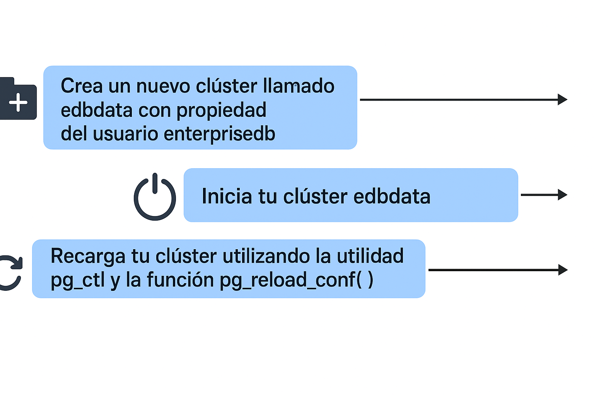
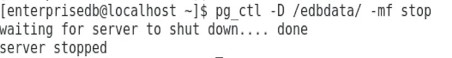

# Clústeres de Base de Datos

## Objetivo de la práctica:
Al finalizar la práctica, serás capaz de:
1.	Se va a desarrollar un nuevo sitio web para una tienda de música en línea. 

- Crea un nuevo clúster llamado edbdata con propiedad del usuario enterprisedb.
- Inicia tu clúster edbdata 
- Recarga tu clúster utilizando la utilidad pg_ctl y la función pg_reload_conf()
- Deten tu cluster edbdata en modo rápido (fast mode).


## Objetivo Visual 


## Duración aproximada:
- 45 minutos.

## Tabla de ayuda:

| Usuario | Password | 
| --- | --- | 
| root | root| 
## Instrucciones 

### Tarea 1. 

1.	Iniciar sesión como usuario root o sudo
2.	Crea el directorio edbdata. Escribe  

```bash
sudo mkdir /edbdata  
```
3.	Cambia la propiedad del directorio al usuario enterprisedb. Escribe:

```bash
sudo chown -R enterprisedb:enterprisedb/edbdata   
```
 

 4.	Iniciar session como enterprisedb escribe:

```bash
su – enterprisedb
```

5.	Crea e inicializa el clúster. Escribe: 

```bash
initdb -D /edbdata -W 
```
Luego introduce dos veces la contraseña del superusuario de la base de datos (es decir, la contraseña de enterprisedb).
 


6.	Cambia el puerto. Escribe:

```bash
vi /edbdata/postgresql.conf  
```
luego presiona la tecla Insert


7. Cambia  port = 5433 (Recuerda descomentar la linea)
   


8. Guarda y cierra el archivo. Escribe:

<Esc>:wq <Enter> 

9.	Inicia el clúster. Escribe:

```bash
pg_ctl -D /edbdata start  
```


10.	Recarga el cluster. Escribe:   
```bash
pg_ctl -D /edbdata reload 
```
O, dentro de la terminal psql, escribe:

```sql
SELECT pg_reload_conf(); 
```


11. Detén el clúster. Escribe:
```bash
pg_ctl -D /edbdata -mf stop
```




12. Inicia el clúster. Escribe:  
```bash
pg_ctl -D /edbdata start 
```


### Resultado esperado

