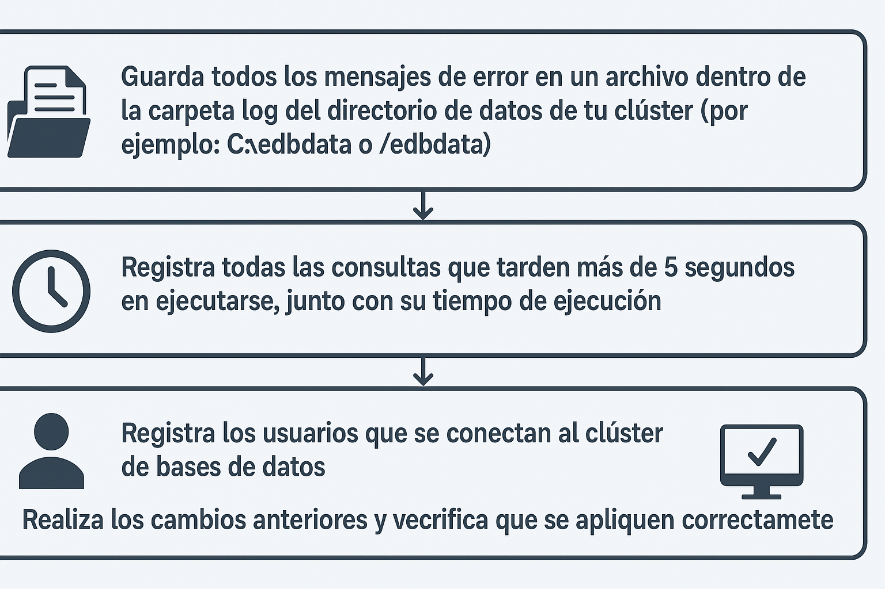

# Shared Buffer 

## Objetivo de la práctica:
Al finalizar la práctica, serás capaz de:

1.	Trabajar como DBA (Administrador de Bases de Datos) es una tarea desafiante, y para rastrear ciertas actividades en el servidor de bases de datos, es necesario implementar registros de auditoría (logging).

Revisa los parámetros del servidor que controlan el registro y configura lo siguiente: 

-	Guarda todos los mensajes de error en un archivo dentro de la carpeta log del directorio de datos de tu cluster (por ejemplo: C:\edbdata o /edbdata) 
-	Registra todas las consultas que tarden más de 5 segundos en ejecutarse, junto con su tiempo de ejecución.
-	Registra los usuarios que se conectan al clúster de bases de datos.
-	Realiza los cambios anteriores y verifica que se apliquen correctamente.


## Objetivo Visual 


## Duración aproximada:
- 30 minutos.

## Tabla de ayuda:

| Usuario | Password | 
| --- | --- | 
| root | root| 
## Instrucciones 

### Tarea 1. 

Nota – Descomenta las líneas de todos los parámetros modificados para asegurarte de que los cambios sean reconocidos por el servidor.

1.	Abre una ventana de terminal. Escribe  

```bash
su – enterprisedb 
```

Luego introduce la contraseña del usuario enterprisedb.

2.	Abre el archive postgresql.conf. Escribe:

```bash
vi /edbdata/postgresql.conf 
```

Luego presiona la tecla "INSERT" para entrar en modo de edición. 


3.	Realiza los siguientes cambios: 

-	log_directory = 'log'
- log_min_duration_statement = 5s 
-	log_connections = on 
-	logging_collector = on   (Necesitas activar este parámetro para que todos los cambios anteriores en los parámetros sean reconocidos).


4.	Guarda y cierra el archivo.  Escribir   

```bash
<Esc>:wq <Enter> 
```
5.	Reinicia el clúster de Postgres para aplicar los cambios. Escribe:  

```bash
pg_ctl -D /edbdata restart
```


6.	Verifica los cambios. Conéctate a la base de datos edb utilizando la terminal de psql. Escribe:

```bash
psql -p 5433 -d edb -U enterprisedb 
```

Luego introduce la contraseña del usuario enterprisedb. 


7.	Salir de psql. Escribe:

```bash
\q 
```

