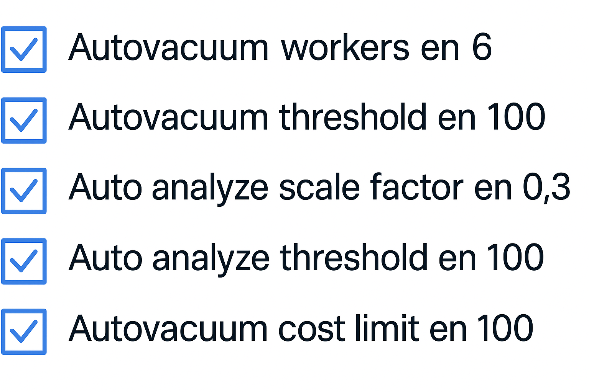

# Shared Buffer 

## Objetivo de la práctica:
Al finalizar la práctica, serás capaz de:

1.	Realiza los siguientes cambios recomendados por un DBA sénior y verifica su aplicación: 
-	Establecer el shared buffer en 256 MB.
-	Configurar la memoria caché efectiva para índices en 512 MB.
-	Asignar memoria de mantenimiento de 64 MB.
-	Definir memoria temporal de 8 MB.

## Objetivo Visual 


## Duración aproximada:
- 30 minutos.

## Tabla de ayuda:

| Usuario | Password | 
| --- | --- | 
| root | root| 
## Instrucciones 

### Tarea 1. 

Nota – Descomenta las líneas de todos los parámetros modificados para asegurarte de que los cambios sean reconocidos por el servidor.  

1.	Abre una ventana de terminal. Escribe  

```bash
su – enterprisedb 
```

Luego introduce la contraseña del usuario enterprisedb.

2.	Abre el archive postgresql.conf. Escribe:

```bash
vi /var/lib/edb/as13/data/postgresql.conf 
```

Luego presiona la tecla "<INSERT>" para entrar en modo de edición. 


3.	Realiza los siguientes cambios: 

- autovacuum_max_workers = 6 
- autovacuum_vacuum_threshold = 100 
- autovacuum_analyze_threshold = 100 
- autovacuum_vacuum_scale_factor = 0.3 
- autovacuum_vacuum_cost_limit = 100

4.	Guarda y cierra el archivo.  Escribir   

```bash
<Esc>:wq <Enter> 
```
5.	Reinicia el clúster de Postgres para aplicar los cambios. Escribe:  

```bash
pg _ctl -D /var/lib/edb/as13/data restart 
```
