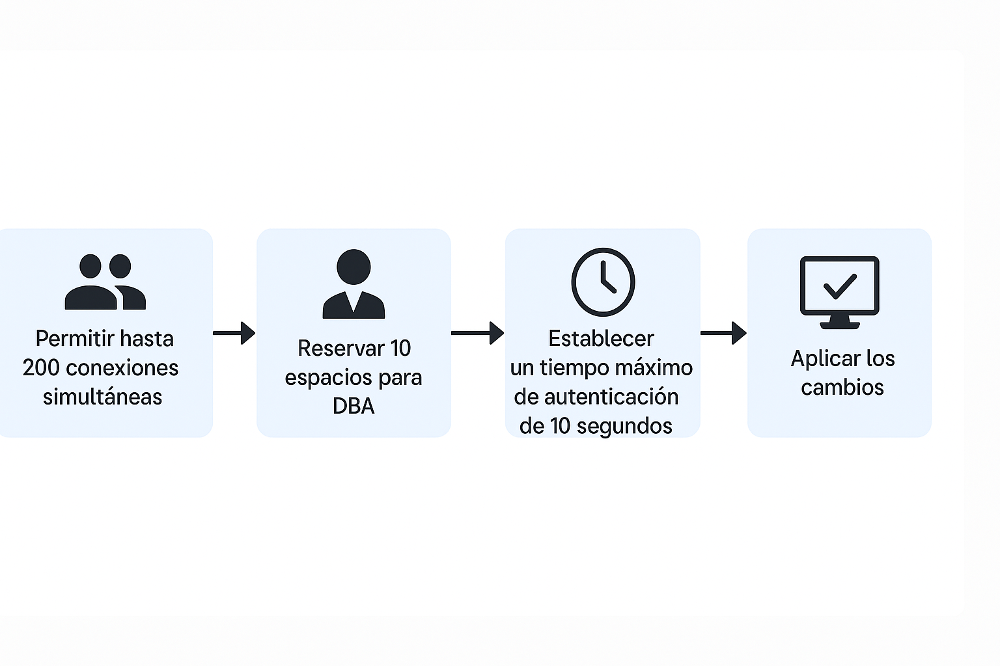
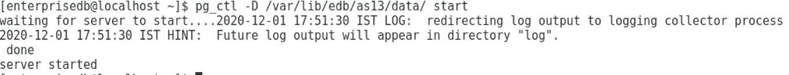

# Configuración

## Objetivo de la práctica:
Al finalizar la práctica, serás capaz de:

1. Estás trabajando como DBA (Administrador de Bases de Datos).
Se recomienda mantener una copia de respaldo del archivo postgresql.conf antes de realizar cualquier cambio. 
Realiza los cambios necesarios en el archivo de parámetros del servidor con las siguientes configuraciones: 

-	Permitir hasta 200 usuarios conectados simultáneamente al servidor.
-	Reservar 10 espacios de conexión para usuarios DBA en el servidor.
-	Establecer un tiempo máximo de 10 segundos para completar la autenticación de clientes. 

## Objetivo Visual 


## Duración aproximada:
- 20 minutos.

## Tabla de ayuda:

| Usuario | Password | 
| --- | --- | 
| root | root| 
## Instrucciones 

### Tarea 1. 

Nota: Descomenta las líneas de todos los parámetros modificados para asegurarte de que los cambios sean reconocidos. 

1.	Abre una ventana de terminal. Escribe  

```bash
su – enterprisedb 
```

Luego introduce la contraseña del usuario enterprisedb.

2.	Abre el archive postgresql.conf. Escribe:

```bash
vi /var/lib/edb/as13/data/postgresql.conf  
```

Luego presiona la tecla "INSERT" para entrar en modo de edición. 


3.	Realiza los siguientes cambios: 

- max_connections = 200 
- superuser_reserved_connections = 10 (recuerda descomentar la línea) 
- authentication_timeout = 10s (recuerda descomentar la línea) 

4.	Guarda y cierra el archivo.  Escribir   

```bash
<Esc>:wq <Enter> 
```
5.	Reinicia el clúster de Postgres para aplicar los cambios. Escribe:  

```bash
pg_ctl -D /var/lib/edb/as13/data restart 
```


