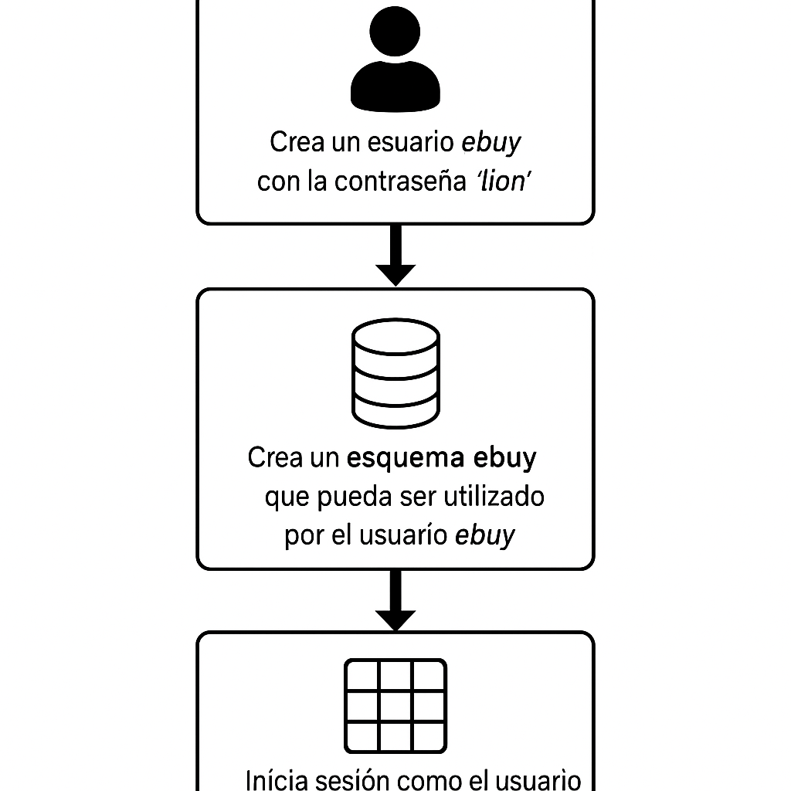
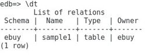

# Uso de esquemas

## Objetivo de la práctica:
Al finalizar la práctica, serás capaz de:

1. El desarrollador de la aplicación del sitio web de música en línea desea agregar una función de compra/venta en línea y te ha pedido separar todas las tablas utilizadas en las transacciones en línea.
Has sugerido usar esquemas. Implementa las siguientes opciones: 

- Crea un usuario ebuy con la contraseña ‘lion’ 
-	Crea un esquema ebuy que pueda ser utilizado por el usuario ebuy. 
-	Inicia sesión como el usuario ebuy, crea una tabla sample1 y verifica si dicha tabla pertenece al esquema ebuy o no. 

## Objetivo Visual 


## Duración aproximada:
- 20 minutos.

## Tabla de ayuda:

| Usuario | Password | 
| --- | --- | 
| root | root| 
## Instrucciones 

### Tarea 1. 

1.	Abre una ventana de terminal. Escribe  

```bash
su – enterprisedb 
```

Luego introduce la contraseña del usuario enterprisedb.


2.	Conéctate a la base de datos edb utilizando la terminal de psql. Escribe  

```bash
psql -d edb -U enterprisedb 
```

Luego introduce la contraseña del usuario enterprisedb.

3.	Crea el usuario ebuy con la contraseña lion.  Escribe

```sql
CREATE USER ebuy PASSWORD 'lion'; 
```

4.	Crea el esquema ebuy. Escribe

```sql
 CREATE SCHEMA ebuy AUTHORIZATION ebuy; 
```

5.	Cambia la conexión a la base de datos edbstore con el usuario edbuser. Escribe:

```sql
\c edb ebuy 
```
Luego introduce la contraseña de lion.

6.	Crea una tabla llamada sample1. Escribe  

```sql
CREATE table sample1(id numeric, name varchar); 
```

7.	Revisa las tablas del esquema actual. 

```sql
\dt 
```




8.	Sal de psql . Escribe  

