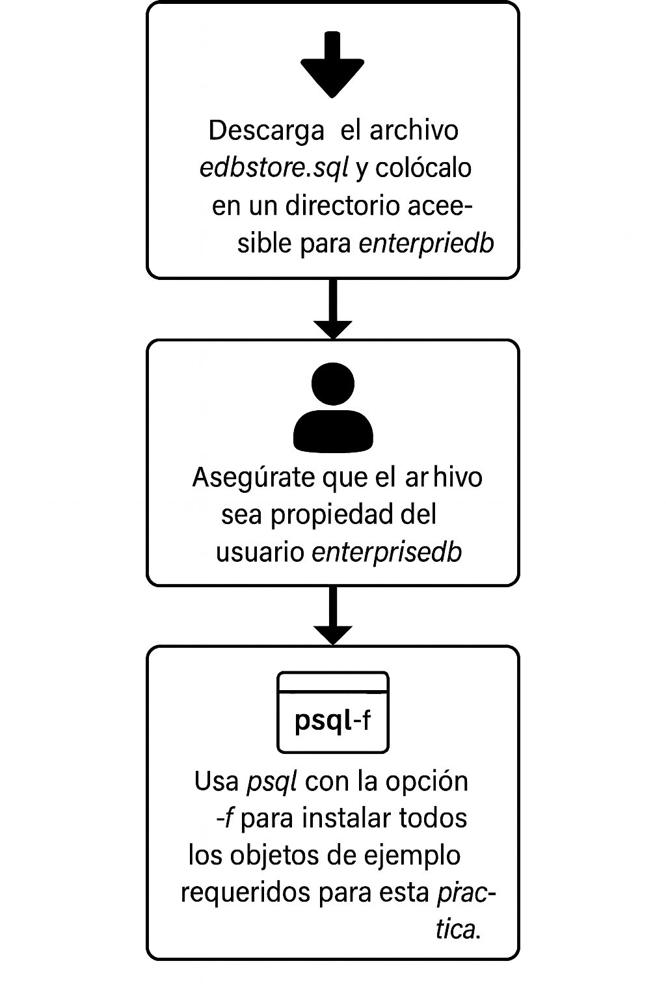
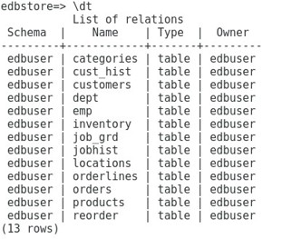
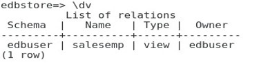
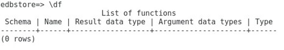
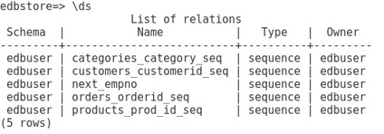

# Creación objetos base de datos

## Objetivo de la práctica:
Al finalizar la práctica, serás capaz de:

1. EnterpriseDB proporcionó un archivo edbstore.sql junto con el material de entrenamiento, y este script puede instalarse en la base de datos edbstore que se creó previamente. 
-	Descarga el archivo edbstore.sql y colócalo en un directorio que sea accesible para el usuario enterprisedb.
-	Asegúrate de que el archivo también sea propiedad del usuario enterprisedb.
-	Ejecuta el commando psql con la opción –f para correr el archive edbstore.sql e instalar todos los objetos de ejemplo requeridos para esta práctica. 
 
Importante: Este laboratorio debe realizarse después del Ejercicio de Laboratorio 1 de este mismo módulo.


## Objetivo Visual 


## Duración aproximada:
- 20 minutos.

## Tabla de ayuda:

| Usuario | Password | 
| --- | --- | 
| root | root| 
## Instrucciones 

### Tarea 1. 

1. Abre una terminal y copia el archivo edbstore.sql en el directorio personal del usuario enterprisedb (https://github.com/NetecGk/POSTSQL_EDB_ESS/blob/main/src/edbstore.sql).

- Inicia sesión como usuario root. Escribe:
```bash
su - root 
```
Luego introduce la contraseña de root.

- Copia el archivo al directorio personal del usuario enterprisedb.  
```bash
cp /home/(admin user name)/Downloads/edbstore.sql /home/enterprisedb/ 
```
*Nota:* el directorio /home/(admin username) corresponde al nombre de inicio de sesión principal de tu sistema Linux. Este nombre puede variar según tu entorno.

- Cambia la propiedad del archivo al usuario enterprisedb.  Escribe:  
```bash
chown enterprisedb:enterprisedb /home/enterprisedb/edbstore.sql  
```
- Cambia el usuario enterprisedb. Escribe:
```bash
su - enterprisedb 
```

Luego ingresa la *contraseña de enterprisedb*, si se solicita. 

- Ejecuta el archivo edbstore.sql para cargar los datos en la base de datos edbstore. Escribe:
```bash
psql -f edbstore.sql -d edbstore -U edbuser 
```
Luego introduce la contraseña del usuario edbuser. 

- Conéctate a la base de datos edbstore y verifica los objetos de ejemplo. Escribe:
```bash
psql -d edbstore -U edbuser 
```
Luego introduce la contraseña de edbuser. 

- Muestra la lista de tablas. Escribe 
```bash
\dt 
```


- Muestra la lista de vistas. Escribe 
```bash
\dv
```



- Muestra la lista de todas las funciones. Escribe 
```bash
\df
```


- Muestra la lista de todas las secuencias. Escribe 
```bash
\ds
```

