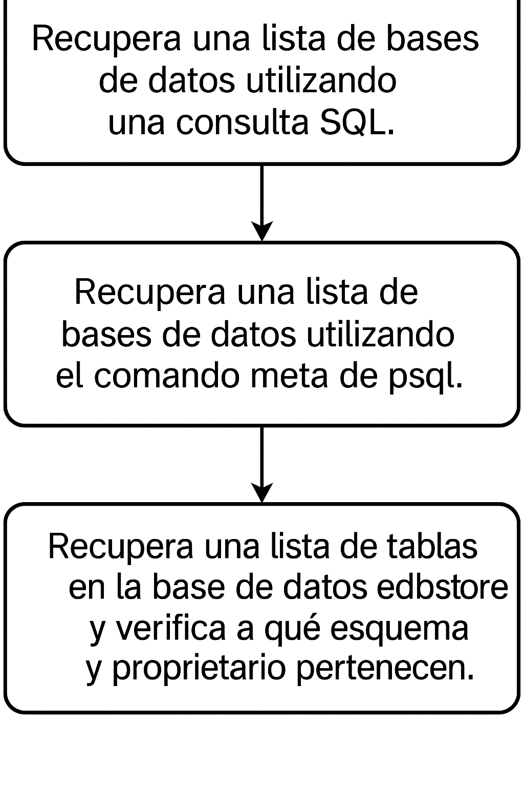
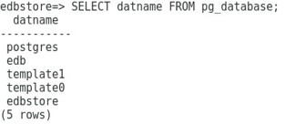
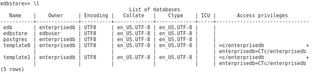
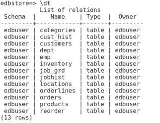

# Consulta de Metadata

## Objetivo de la práctica:
Al finalizar la práctica, serás capaz de:

- Recuperar una lista de bases de datos utilizando una consulta SQL. 
- Recuperar una lista de bases de datos utilizando el comando meta de psql. 
- Recuperar una lista de tablas en la base de datos edbstore y verifica a qué esquema y propietario pertenecen.


## Objetivo Visual 


## Duración aproximada:
- 30 minutos.

## Tabla de ayuda:

| Usuario | Password | 
| --- | --- | 
| root | root| 
## Instrucciones 

### Tarea 1. 

1.	Conéctate a la base de datos edbstore. Escribe:  
```bash
\df
```
Luego introduce la contraseña del usuario edbuser. 

2.	Recupera una lista de bases de datos usando una consulta SQL.  Escribe:

```sql
SELECT datname FROM pg_database;
```



3.	Lista las bases de datos usando un comando de psql. Escribe:  

```sql
\l 
```




4.	Muestra la lista de tablas en la base de datos edbstore y verifica su esquema y propietario.  Escribe:  

```sql
\dt 
```



o, si deseas ver tablas específicas junto con su esquema:
```sql
SELECT table_schema, table_name, tableowner 
FROM pg_tables 
WHERE schemaname NOT IN ('pg_catalog', 'information_schema'); 
```

5.	Salir de psql. Escribe :
```sql
\q
```
