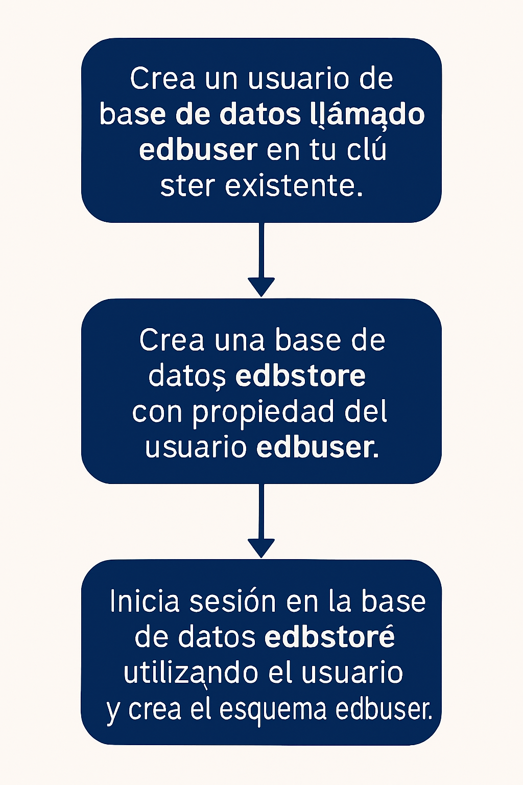

# Creación de una base de datos

## Objetivo de la práctica:
Al finalizar la práctica, serás capaz de:

1. Se va a desarrollar un nuevo sitio web para una tienda de música en línea. 
- Crea un usuario de base de datos llamado edbuser en tu clúster existente. 
- Crea una base de datos edbstore con propiedad del usuario edbuser . 
- Inicia sesión en la base de datos edbstore utilizando el usuario edbuser y crea el esquema edbuser
- Cierra la sesión de psql. 


## Objetivo Visual 


## Duración aproximada:
- 30 minutos.

## Tabla de ayuda:

| Usuario | Password | 
| --- | --- | 
| root | root| 
## Instrucciones 

### Tarea 1. 

1.	Abre una ventana de terminal. Escribe  

```bash
su – enterprisedb 
```

Luego introduce la contraseña del usuario enterprisedb.


2.	Conéctate a la base de datos edb utilizando la terminal de psql. Escribe  

```bash
psql -d edb -U enterprisedb 
```

Luego introduce la contraseña del usuario enterprisedb.

3.	Crea el usuario edbuser con su contraseña de edb. Escribe

```sql
CREATE USER edbuser PASSWORD 'edbuser'; 
```

4.	Crea la base de datos edbstore con el propietario edbuser. Escribe:  

```sql
CREATE DATABASE edbstore owner edbuser; 
```

5.	Cambia la conexión a la base de datos edbstore con el usuario edbuser. Escribe:

```sql
\c edbstore edbuser 
```
Luego introduce la contraseña de edbuser.

6.	Crea el esquema edbuser. Escribe:

```sql
CREATE SCHEMA edbuser authorization edbuser; 
```

7.	Sal de psql . Escribe  

```sql
\q 
```


