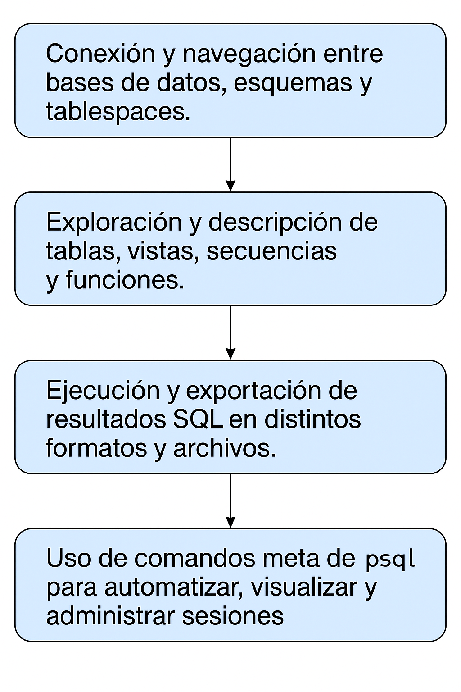

# Creación de una base de datos

## Objetivo de la práctica:
Al finalizar la práctica, serás capaz de:

- Conexión y navegación entre bases de datos, esquemas y tablespaces.
- Exploración y descripción de tablas, vistas, secuencias y funciones.
- Ejecución y exportación de resultados SQL en distintos formatos y archivos.
- Uso de comandos meta de psql para automatizar, visualizar y administrar sesiones.


## Objetivo Visual 


## Duración aproximada:
- 45 minutos.

## Tabla de ayuda:

| Usuario | Password | 
| --- | --- | 
| root | root| 
## Instrucciones 

### Tarea 1. 

1.	Conéctate a la base de datos usando psql. Escribe:

```bash
psql -d edb enterprisedb  
```

Luego introduce la contraseña del usuario enterprisedb.


2.	Cambia a la base de datos edbstore.  Escribe:

```bash
\c edbstore edbuser   
```

Luego introduce la contraseña del usuario edbuser.

3.	Describe la tabla customers . Escribe:
```sql
\d customers  
```

4.	Describe la tabla customers incluyendo su descripción. Escribe:  
```sql
\d+ customers  
```

5.	Lista de bases de datos. Escribe 
```sql
\l 
```

6.	Lista de todos los esquemas. Escribe: 
```sql
\dn   
```

7.	Lista todos los tablespaces. Escribe: 
```sql
\db   
```

8.	Ejecuta una instrucción SQL y guarda el resultado en un archivo. Escribe: 
```sql
\o customer_data.txt 
SELECT * FROM customers; 
\o 
```

9.	Repite lo anterior, pero guardando solo los datos (sin encabezados). Escribe:  
```sql
\t 
\o customer_data.txt 
SELECT * FROM customers; 
\o \t 
```

10.	Crea un script SQL mediante otro método y ejecútalo desde psql.

- salir de psql. Escribe: 
```sql
\q
```

- Crear archivo en SQL. Escribe: 
```sql
vi emp.sql  
SELECT * FROM emp; 
<ESC>:wq <ENTER> 
```

- Vuelve a conectarte a psql y ejecuta el script. Escribe:  
```sql
psql -f emp.sql -d edbstore -U edbuser 
```
Luego introduce la contraseña del usuario edbuser. 

- Conéctate a la base de datos edbstore usando psql. Escribe:
```sql
psql -d edbstore -U edbuser  
```

11.	Activa el modo de formato expandido de tabla.  Escribe:
```sql
\x 
SELECT * FROM dept; 
\x 
```

12.	Lista tablas, vistas y secuencias con sus privilegios de acceso asociados. Escribe:  
```sql
\dp 
```

13.	Muestra el texto SQL de una función. Escribe: 
```sql
\df+ <functionname> 
```

14.	Visualiza el directorio de trabajo actual. Escribe:
```sql
\! pwd  
```

15.	Sal de psql. Escribe  
```sql
\q 
```
