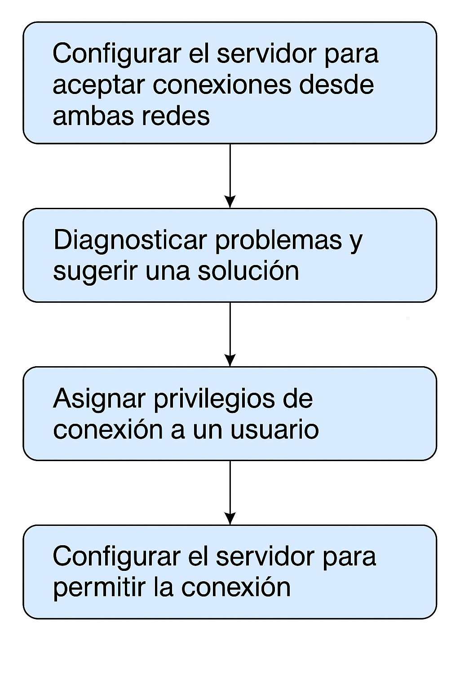

# Seguridad

## Objetivo de la práctica:
Al finalizar la práctica, serás capaz de:

- Configurar el servidor para aceptar conexiones desde ambas redes.
- Diagnosticar problemas y sugerir una solución.
- Asignar privilegios de conexión a un usuario
- Configurar el servidor para permitir la conexión 


## Objetivo Visual 


## Duración aproximada:
- 45 minutos.

## Tabla de ayuda:

| Usuario | Password | 
| --- | --- | 
| root | root| 
## Instrucciones 

### Tarea 1. 

Eres un DBA de EDB Postgres Advanced Server. Tu servidor tiene dos tarjetas de red con las siguientes direcciones IP:

-	192.168.30.10 → utilizada para la red interna (LAN).
-	10.4.2.10 → utilizada por el servidor web para conectar usuarios desde una red externa.

El servidor debe aceptar conexiones TCP/IP tanto de usuarios internos como externos. Configura el servidor para aceptar conexiones desde ambas redes. 


1.	Conéctate a la base de datos usando psql. Escribe:

```bash
psql -d edb enterprisedb  
```

Luego introduce la contraseña del usuario enterprisedb.

2.	Abre el archivo de configuración postgresql.conf.

```bash
vi /var/lib/edb/as13/data/postgresql.conf  
```

3.	Realiza el siguiente cambio: 

```bash
listen_addresses='*' 
```

4.	Guarda y Cierra el archivo. Escribe:  

```bash
<Esc>:wq <Enter> 
```

5.	Reinicia el clúster de Postgres para aplicar los cambios. Escribe:

```bash
pg_ctl -D /var/lib/edb/as13/data restart 
```

### Tarea 2. 

Trabaja como administrador de base de datos (DBA) de EDB Postgres Advanced Server. Un desarrollador le mostró el siguiente error:  

psql: could not connect to server: Connection refused (0x0000274D/10061) 

¿El servidor se está ejecutando en el host "192.168.30.22" y acepta conexiones TCP/IP en el puerto 5444?? 

Diagnostica el problema y sugiere una solución.

1.	Este error puede deberse a las siguientes causas: 
- El servidor de base de datos no está en ejecución.
- El servidor no está configurado para aceptar conexiones TCP/IP externas.
- El puerto del postmaster no está abierto en el firewall.

2.	Soluciones sugeridas:

- Verifica el estado del servidor de base de datos. Escribe:
```bash
pg_ctl -D /var/lib/edb/as13/data status 
```

- Inicia el servidor si no está corriendo. 
```bash
pg_ctl -D /var/lib/edb/as13/data status 
```

- Abre el archivo postgresql.conf..
```bash
vi /var/lib/edb/as13/data/postgresql.conf 
```

- Editar el parametro listen_addresses . Asegurate de que este asi: 
```bash
listen_addresses='*' 
```

- Guarda y Cierra el archivo.
```bash
<Esc> :wq <Enter>  
```

- Reinicia el cluster si el parámetro fue modificado. listen_addresses.  Escribe:
```bash
pg_ctl -D /var/lib/edb/as13/data restart 
```

- Abre el puerto 5444 en el firewall (como root o administrador del sistema)
```bash
firewall-cmd --zone=public --addport=5444/tcp success
firewall-cmd --list-ports  8443/tcp 5432/tcp 5444/tcp  
```
### Tarea 3. 

Un nuevo desarrollador se une al equipo con ID 89.  
- Crea un usuario llamado dev89 con contraseña password89.
- Asígnale los privilegios necesarios para que pueda conectarse a la base de datos edbstore y ver todas las tablas.

1.	Abre una terminal e inicia sesión como enterprisedb.  
```bash
su – enterprisedb   
```
Luego inserte contraseña.

2.	Conectate a la base de datos edbstore.
```bash
psql -d edbstore -U enterprisedb  
```
Luego inserte contraseña.

3.	Crea el usuario dev89.
```sql
CREATE USER dev89 PASSWORD 'password89';   
```

4.	Concede permisos de conexión al usuario dev89. 
```sql
GRANT CONNECT ON DATABASE edbstore to dev89;  
```

5.	Concede al usuario dev89 permisos de uso sobre el esquema edbuser.
```sql
GRANT USAGE ON SCHEMA edbuser TO dev89; 
```

6.	Concede permisos de selección sobre todas las tablas del esquema edbuser. 
```sql
GRANT SELECT ON ALL TABLES IN SCHEMA edbuser TO dev89; 
```

7.	Cambia la conexión edbstore al usuario dev89. 
```sql
\c edbstore dev89 
```

Luego introduce la contraseña password89.
 
8.	Verificar en el usuario dev89 el acceso a las tablas. 
```sql
SELECT * FROM edbuser.dept; 
```

9.	Sal de psql.  
```sql
\q 
```

### Tarea 4. 
Un nuevo desarrollador se une a la empresa e-music corp. Su dirección IP es 192.168.30.89, pero no puede conectarse al servidor EDB Postgres Advanced. El servidor muestra el siguiente error: 
 
FATAL:  no pg_hba.conf entry for host “192.168.30.89", user “dev89", database “edbstore", SSL off 

Configura el servidor para permitir la conexión de este nuevo desarrollador. 

1.	Abre una terminal e inicia sesión como el usuario enterprisedb.
```bash
su – enterprisedb 
```
Luego ingresar contraseña.

2.	Edita el archivo pg_hba.conf .
```bash
vi /var/lib/edb/as13/data/pg_hba.conf 
```

3.	Agrega la siguiente línea al final del archivo pg_hba.conf . 
```bash
host edbstore dev89 192.168.30.89/32 md5 
```

4.	Guarda y cierre el archivo. 
```bash
<ESC>:wq <Enter> 
```

5.	Recarga el cluster para aplicar los cambios. 
```bash
pg_ctl -D /var/lib/edb/as13/data reload 
```


